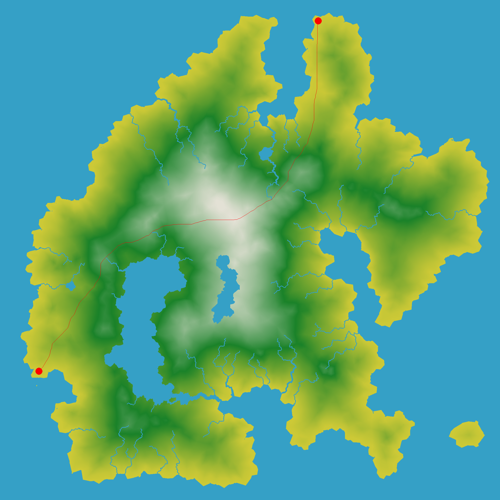

# Save the marriage

## Project Overview
### 1. Goal

The main aim of the project is implement an **optimal path finding** algorithm that can determine the quickest route from ```(ROVER_X, ROVER_Y)``` to ```(BACHELOR_X, BACHELOR_Y)``` and finally drop off the bachelor to his destination at ```(WEDDING_X, WEDDING_Y)```. To achieve this task, I have implemeted the **A\* search algorithm**

The results from my program have been visualised below for convenience:



```
    Code execution time: 24.74 seconds
    Nodes expanded: 1981274
    Path traversal time: 2167.5 island seconds
    
```


```
    Code execution time: 12 seconds
    Nodes expanded: 713583
    Path traversal time: 1322.12 island seconds
```

### 2. Project Structure
* **assets/**: Holds the elevation (std::uint8_t) and terrain data (std::uint8_t) for the island under investigation
* **search/**: This library forms the kernel or the main component for the coding challenge. It implements the **A\* search algorithm** for optimal path finding
* **test/**: Collection of unit tests (written using GoogleTest)
* **utilities/**: Library providing common utilities being used across the project. Noteably, a *concurrent* Logger interface type 
* **visualizer/**: Library for drawing a bitmap image of the island
* **CMakeLists.txt**: Main input to the CMake build system for building the overall project
* **CMakeLists.txt.in**: Script that leverages CMake to download GoogleTest as part of the build's configure step
* **main.cpp**: Program runner
* **island.png**: PNG image of the island for visulisation

## Algorithm choice

### Overview
The image of our island can be modelled as a **graph** where each pixel is connected to eight adjacent pixels (i.e. the allowed directions of movement). Therefore, our task of finding the quickest/optimal path can be reduced down to a *graph search problem*.

There are a wide range of graph search algorithms, namely: BFS, DFS, Uniform Cost Search, Greedy Best First Search, etc. However, for this task I decided to exploit the **A\* search algorithm** for two main reasons:
* Compared to its counterparts, it's more *intelligent* (i.e. it's a search algorithm with brains) and is relatively less wasteful. Instead of exploring every single node layer by layer like the Breadth First search or exploring all possible paths like Depth First Search, A* search aims to expand only a selective number of paths based on a user defined criteria, thus,
* It finds the shortest possible path while expanding the smallest number of paths possible

At its core, at each iteration, this algorithm expands the path with the minimum value of 
```f(n) = g(n) + h(n)``` where ```g(n) = Path cost from the start node to node n```, and ```h(n) = estimate of the minimum cost from node n to the goal```. This process is repeated iteratively until we either converge to our solution or run out of nodes to expand.

### Units
To be able to add the two values i.e. ```g(n)``` and ```h(n)```, these values need to be at the same scale or unit. For the purposes of this task, both ```g(n)``` and ```h(n)``` are modelled as time taken in ```island seconds```

### Modelling the step cost

The ```g(n) = PathCost(n-1) + stepCost(n-1, n)```. ```PathCost(n-1)``` is simply the sum of all the step costs constituting the path up until and including node n-1

Since the terrain in the island isnt uniform (i.e. it contains different levels of elevations), this was accounted for when modelling the step cost function.

The step cost is calculated using the ```time = distance/speed``` formula where the elevation is factored into the speed to simulate the effect of the rover speeding up while going downhill and slowing down when going uphill. Consequently, this affects the traversal time, and is thus fed into the A* search algorithm for consideration when selecting the paths. The mathematical / code translation for the method described above can be seen as follows:

``` c++
float AStar::computeStepCost(const int src, const int dest) {
	auto dx = std::abs((src % imgDim) - (dest % imgDim));
	auto dy = std::abs((src / imgDim) - (dest / imgDim));

	// Results in either 1.0 or sqrt(2)
	float horizontalDist = std::sqrt(dx * dx + dy * dy);

	// Factoring in the elevation angle and scaling it to the range of (-2., 2.)
	// to make the scales match with the horizontalDist
	float delevation = ((elevationData[dest] - elevationData[src]) / 255.0) * 2.0;

	// Computing the overall distance owing to the elevation diff 
	float totalDist = std::sqrt(horizontalDist * horizontalDist + delevation * delevation);

	// Rovers normal speed
	float speed = 1.0;

	// Calculating the cost (in seconds) as a function of distance and elevation angle.
	// The formula below increases the time when going uphill and conversely decreases the time
	// while going downhill
	float cost;
	cost = totalDist / (speed * (1 - delevation));
	return cost;
}
```

### Heuristic selection

The most important component of the A* search algorithm is the Heuristic (i.e. an estimate of the minimum cost from any node n to the goal). In order for the A* search algorithm to find the shortest cost path, the heuristic needs to satify two important criterion:
1. It should **NEVER** overestimate the distance to the goal
2. Should be **admissible / optimistic**. A* is only admissible if the heuristic, ```h(n)``` never over-estimates the distance to the goal. 

I tried two different heuristics namely:
1. Diagonal Distance Heuristic, and
2. L-infinity Heuristic

I ended up choosing the **L-infinity/Chebyshev distance** heuristic since it gave me the quickest convergence time.

The implementation of the two heuristic metrics has been detailed below for convenience. 

``` c++
float AStar::computeHeuristicCost(const int node, const int start, const int goal) {
	float D = 1.0;
	float D2 = std::sqrt(2.0);
	auto dx = std::abs((node % imgDim) - (goal % imgDim));
	auto dy = std::abs((node / imgDim) - (goal / imgDim));

	// L infinity heuristic / Chebyshev distance
	float heuristic = std::max(dx, dy);

	// Diagonal Distance Heuristic
	//float heuristic = D * (dx + dy) + (D2 - 2 * D) * std::fmin(dx, dy);
	
	/* Alternative Tie Breaking approach: Computes the vector cross-product between
		the start to goal vector and the current node to goal vector. When these vectors
		don’t line up, the cross product will be larger. Therefore, the
		algorithm should some give slight preference to a path that lies along the straight line
		path from the start to the goal. 
		Note: although this approach gave great results in finding a path between Bachelor -> Wedding,
		for some odd reason this technique seems to get trapped while searching for a path between
		Rover -> Bachelor. Need to investigate and use this as future work for an even speedier
		convergence
	*/
	//auto dx2 = (start % imgDim) - (goal % imgDim);
	//auto dy2 = (start / imgDim) - (goal / imgDim);
	//float cross = std::abs(dx * dy2 - dx2 * dy);
	//auto heuristicWithTieBreak = heuristic + cross * 0.0003;
	
	return heuristic;
}
```

### Tie breaking

While testing out the algorithm it was observed that there were many paths with the same length. For example, in areas without variation in terrain, there were many equal-length paths. As a result, A* was exploring all the paths with the same f value, instead of only one. To avoid this, *tie-breaking* techniques were investigated.

For this task, I use the ```h``` value in the node comparison function. Whenever the ```f``` values are equal, the node comparison function will break the tie by looking at ```h```. The implementation of has been provided below to the reader:

```c++
/* The std::priority_queue<T> implements a max-heap by default. Since, we want to pop the node
	with the smallest value of fhat (= PathCost + HeuristicCOst) we flip the sign
*/
bool operator<(const Node &n1, const Node &n2) {
	/* Used to perform Tie-Breaking, i.e. pick the node that has a lower estimated cost to
		the goal, thus leading to faster convergence
	*/
	if (n1.fhat == n2.fhat)
		return n1.hhat > n2.hhat;

	return n1.fhat > n2.fhat;
}
```

## Future work & closing remarks

As future work, I would like to:
1. Explore the use of a variation of the *Jump Point Search* to even better deal with tie breaking and skipping many redundant nearby nodes all with the same values of ```f``` constituting in noise. This should lead to an even quicker convergence time.
2. Use a *Fixed Size Allocator* for dynamic memory allocation of the ```Node``` types


